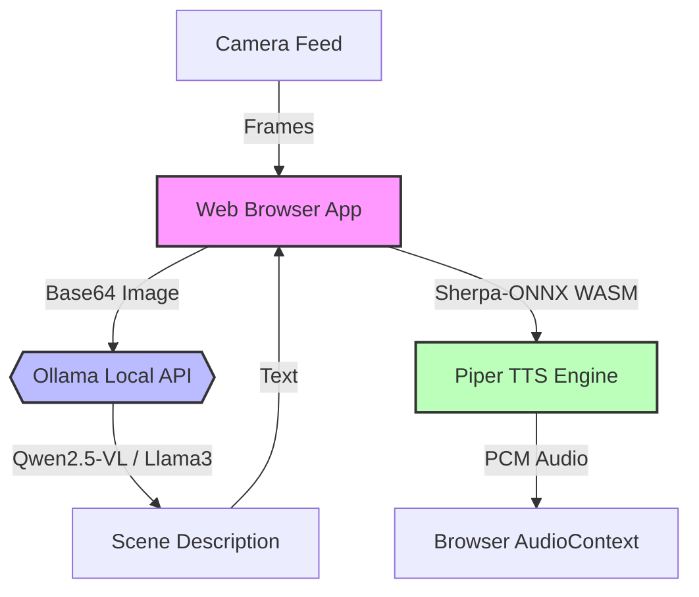

# Local AI Mission Console 🚀

**Your browser becomes a private AI computer.**

The Local AI Mission Console is a minimal, elegant, and powerful demonstration of local Edge AI. It bridges the gap between browser-side execution (using the **RunAnywhere Web SDK**) and local backend inference (using **Ollama**), creating a fully private, multimodal AI pipeline.

[Video Demo](https://youtu.be/okRPaIvrjwQ)


## 🌟 The Vision

Traditional AI applications send your voice, text, and images to centralized servers. The Local AI Mission Console flips this model: **it brings the AI directly to your hardware.**

By running Vision-Language Models (VLMs) and Text-to-Speech (TTS) locally, it guarantees:
- **Zero Latency**: No waiting for server round-trips.
- **Absolute Privacy**: Your camera feed and data never leave your machine.
- **Offline Capability**: Works completely decoupled from the cloud.

## 🏗️ Technical Architecture

This project pioneers a hybrid "Local-Edge" architecture, optimally distributing heavy AI workloads across your machine's resources:



### The Pipeline
1. **Perception**: The browser safely accesses your webcam and extracts a high-quality frame.
2. **Reasoning (Ollama)**: Because Vision-Language Models (like `qwen2.5-vl`) are GPU-intensive, the heavy lifting is offloaded to Ollama running locally on your hardware. This keeps the browser lightweight.
3. **Synthesis (RunAnywhere / WebAssembly)**: The text response is streamed back to the browser, where the **RunAnywhere Web SDK** initializes a WebAssembly-compiled Sherpa-ONNX engine. It uses a Piper `en_US-amy-low` voice model to synthesize studio-quality speech *entirely within the browser's memory*.

### The TTS Magic (Robust WASM Staging)
To achieve flawless in-browser TTS, the app uses an advanced WASM filesystem hydration technique:
- The app fetches a single `.tgz.bin` archive containing the Piper `.onnx` model, `tokens.txt`, and over 350 files of `espeak-ng-data`.
- This archive is manually extracted directly into the Sherpa-ONNX virtual filesystem.
- The `TTS` provider is accessed via the SDK's `ExtensionPoint` registry to ensure perfect physical singleton isolation, preventing Vite module-duplication errors.

## 🚀 Getting Started

### Prerequisites
1. **Ollama**: [Download and install Ollama](https://ollama.com/).
2. **Vision Model**: Pull a robust VLM (we recommend Qwen for vision):
   ```bash
   ollama run qwen2.5-vl
   ```
   *(Note: You can use any model Ollama supports; the UI will autodetect them).*
3. **Camera Access**: A webcam is required.

### Installation

1. Clone the repository and install dependencies:
   ```bash
   npm install
   ```

2. Run the development server:
   ```bash
   npm run dev
   ```

3. Open the app at `http://localhost:5173`. Select your model, and click "Analyze Scene"!

## 💡 Ideas for Extensions and Forks

The Local AI Mission Console is designed as a foundation. Here are ways you can extend it:

- **Continuous Monitoring (Dashcam Mode)**: Modify `pipeline.ts` to run a `setInterval` loop, creating an AI that narrates what it sees every 10 seconds.
- **Security Guard**: Add an instruction to the Ollama prompt: "Only respond if you see a person, describe their clothing." Tie this to an alert system.
- **Accessibility Aide**: Deploy this on a mobile browser. Users can point their phone at signs or documents, and the local AI reads it aloud to them.
- **Local RAG Integration**: Instead of just describing the scene, pass the description to a local ChromaDB instance to retrieve context before generating the speech.

## 🛠️ Built With
- **[RunAnywhere Web SDK](https://github.com/runanywhere)**: Standardized APIs for bridging WASM AI, Audio/Video capture, and device capabilities.
- **[Ollama](https://ollama.com/)**: Local LLM/VLM inference engine.
- **[Vite](https://vitejs.dev/) & TypeScript**: Fast, typed frontend tooling.
- **[Piper/Sherpa-ONNX](https://github.com/k2-fsa/sherpa-onnx)**: Blazing fast offline Text-to-Speech.
